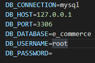
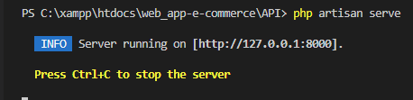

<h1 algin="center">API RESTful</h1>

  
Sommario

  <ol>
    <li>
      <a href="#informazioni-sul-progetto">Informazioni sul progetto</a>
      <ul>
        <li><a href="#costruito-con">Costruito con</a></li>
         <li><a href="#software-utilizzati">Software utilizzati</a></li>
      </ul>
    </li>
   <li><a href="#descrizione">Descrizione</a>
     <ul>
        <li><a href="#Download-e-testare-app-in-locale">Download e testare app in locale</a></li>
      </ul>
    </li>
   <li><a href="#licenza">Licenza</a></li>
  <ol>

<!-- Informazioni sul progetto-->

## Informazioni sul progetto
E' stata realizzata un'API RESTful che gestisce:
<ul>
<li> login/logout dell'utente,</li>
<li> registrazione dell'utente,</li> 
<li>recupero/reset password,</li>
<li> recupero prodotti dal database e carrello acquisti dell'utente</li>
<ul>  

### <h3>Costruito con:</h3>

<b>Framework</b>:

- [Laravel] (https://laravel.com)

<b>Database</b>:

- [MySQL] (https://www.mysql.com/it/)

#### <h3>Software utilizzati</h3>
      
 <b>Gestore di pachetti per linguaggio di programmazione PHP</b>:

- [COMPOSER] (https://getcomposer.org/)
      
 <b> Piattaforma software </b>:
      
 - [XAMPP] (https://www.apachefriends.org/it/index.html)
      
<!--Descrizione-->

## Descrizione

### Sviluppo
- L' API è stata sviluppata con Laravel 9 .

- Pachetti laravel utilizzati:
   - Sanctum
   - Fortify

<b>Laravel Sanctum</b> è un pacchetto Laravel semplice e leggero per implementare un sistema di autenticazione API REST per applicazioni mobile, applicazioni a pagina singola (SPA) e API basate su token.
 
In questo caso, di Laravel Sanctum si è utilizzato i servizi di autenticazione di sessione basati su cookie.
Questo approccio all'autenticazione offre i vantaggi della protezione CSRF, dell'autenticazione della sessione e protegge dalla perdita delle credenziali di autenticazione tramite XSS
 
<b>Laravel Fortify</b> è un'implementazione di backend di autenticazione indipendente dal frontend per Laravel. Fortify registra i percorsi e i controller necessari per implementare tutte le funzionalità di autenticazione di Laravel, inclusi accesso, registrazione, reimpostazione della password, verifica e-mail e altro ancora.

### Download e testare app in locale

- Sul proprio dispositivo è necessario installare: 
  
   - un ambiente di sviluppo web con una versione minima di PHP v ^ 8.0.2.

   - [Composer] gestore di pacchetti a livello applicativo per il linguaggio di programmazione PHP (https://getcomposer.org/download/) 
   
- Scaricare il Repository.

- Sè si utilizza come ambiente di sviluppo XAMPP o MAMP  si consiglia di posizionare la folder del repository, che include le cartelle WEB_APP e API ,nella directory <b>" htdocs "</b> , in quanto per impostazione predefinita i file vengono serviti da tale directory.

- Aprire la folder API attraverso il prompt dei comandi ed eseguire il comando "composer install".
In questo modo si vanno in automatico ad installare tutte le dipendenze e le librerie di cui necessita l'applicazione.

- Una volta avviati Apache e MySql, attraverso un client MySQL (per esempio phpMyAdmin) creare un nuovo database.
- Nella folder dell'API rinominare il file ".env.example" in ".env". 
- Aprire il file ".env" e impostare i valori di connessione al database .
 

 

- Ora è possibile eseguire le migrations del database dell'applicazione.
 

- Per le migrazioni si utilizza il tool fornito da Laravel:

  - Attraverso il prompt dei comandi eseguire il comando: <b>php artisan migrate</b>;
  - dopo eseguire il 'seeding' del database attraverso il comando: <b>php artisan db:seed</b> 
       
    Con il Seeding si vanno a popolare la tabella products, product_categories, e users .
    Nella tabella 'users' viene inserito un solo utente, con  le seguenti credienzali: 
      - email: giacomorossi@gmail.com;
      - password: Test2022? 
  - Impostare nel file .env le variabili:
    - SESSION_DOMAIN,
    - SANCTUM_STATEFUL_DOMAINS.
      
     <b>SESSION_DOMAIN</b>: Questo determinerà a quali domini è disponibile il cookie nell'applicazione
      
      
     <b>SANCTUM_STATEFUL_DOMAINS</b>: Domini con stato.
      Le richieste dai seguenti domini/host riceverà cookie di autenticazione API con stato. 
      In genere, questi dovrebbero includere il tuo dominio locale
      e domini di produzione che accedono alla tua API tramite una SPA frontend.
        
    <b>N.B</b>: API e Single page application (SPA) devono condividere lo stesso dominio di primo livello;
      
    <b>PER ESEMPIO:</b>
     
    
       - L'API è raggiungibile in locale  su http://127.0.0.1:8000;
       
       - Invece la web app e raggiungibile su http://127.0.0.1:5173/;
        
      Quindi impostare:
       
       SESSION_DOMAIN= 127.0.0.1;
        
       SANCTUM_STATEFUL_DOMAINS = 127.0.0.1:5173 
</b>

- L'API gestisce anche il recupero della password, questo avviene attraverso l'invio di una email all'utente interessato. Per questo motivo impostare nel file .env le variabili di ambiente per l'invio dell'email.
 
Sei libero di utilizzare qualsiasi server SMTP che preferisci, come Gmail. Le relative configurazioni sono fatte nel file config/mail.php . Nella configurazione predefinita di Laravel, la configurazione dell'e-mail viene letta dalle variabili di ambiente,

  - MAIL_MAILER=smtp
  - MAIL_HOST=smtp.googlemail.com
  - MAIL_PORT=465
  - MAIL_USERNAME=youremail@gmail.com
  - MAIL_FROM_ADDRESS=youremail@gmail.com
  - MAIL_PASSWORD=wempehveagsrjwxc  //create app password to access google account
  - MAIL_ENCRYPTION=ssl
  - MAIL_FROM_NAME="${APP_NAME}"

    
  <b>MAIL_MAILER</b>: Questa opzione controlla il mailer predefinito utilizzato per inviare qualsiasi e-mail/
 messaggi inviati dalla tua applicazione. È possibile impostare e utilizzare mailer alternativi secondo necessità; 
 Lasciandolo vuoto di defaoult sarà uguale smt (SMTP è l'acronimo di Simple Mail Transfer Protocol, letteralmente “protocollo semplice di trasferimento di posta”).
   
  
Durante lo sviluppo dell'API ho utilizzato  Mailtrap Email Delivery come soluzione di invio, che fornisce  la configurazione SMTP preimpostata.
Al seguente link: <a>https://mailtrap.io/signin</a> si puo accedere o registrare con un account free per avere un indirizzo di prova.

  

Dopo aver impostato le variabili nel file .env ritornare al prompt dei comandi ed eseguire:

- php artisan cache:clear;
- php artisan key: generate;
 
 
<b>php artisan key:generate</b> è un comando che imposta il valore APP_KEY nel tuo".env" file.

- Ora si puo avviare l'API attraverso il comando: <b>php artisan serve</b> 

## Licenza

The Laravel framework is open-sourced software licensed under the [MIT license](https://opensource.org/licenses/MIT).

