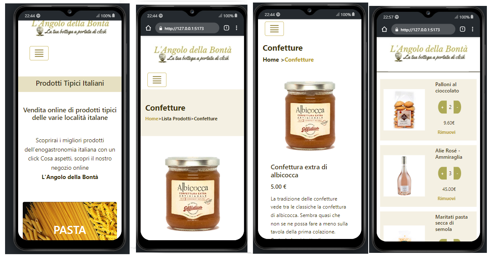
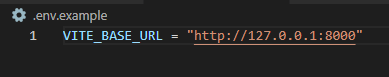
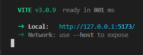

<h1 algin="center">Web app</h1>

  
Sommario

  <ol>
    <li>
      <a href="#informazioni-sul-progetto">Informazioni sul progetto</a>
      <ul>
        <li><a href="#costruito-con">Costruito con</a></li>
      </ul>
    </li>
   <li><a href="#descrizione">Descrizione</a>
     <ul>
        <li><a href="#Download-e-testare-app-in-locale">Download e testare app in locale</a></li>
      </ul>
    </li>
   <li><a href="#licenza">Licenza</a></li>
  <ol>

<!-- Informazioni sul progetto-->

## Informazioni sul progetto
#### <h3>Costruito con:</h3>

- [Vue.js] (https://vuejs.org/)
- [Pinia] (https://pinia.vuejs.org/)
- [Pinia-plugin-persistedstate] (https://github.com/prazdevs/pinia-plugin-persistedstate)
- [Bootstrap] (https://getbootstrap.com/)

<!--Descrizione-->

## Descrizione

### Descrizione Funzionamento

L’applicazione web, è un’app mobile first creata in Vue.js, composta da quattro viste "principali":

 - Vista categorie  (HomeView.vue)
 - Vista Lista prodotti in base alla categoria scelta (ProductList.vue)
 - Vista detaglio prodotto (ProductView.vue)
 - Carrello (CartProduct.vue)

L' applicazione esegue delle chiamate ad un'API RESTful appositamente sviluppata che gestisce:
 -  un sistema di login/logouth , registarzione dell'utente , e recupero password;
 - un sistema per il recupero dei prodotti dal DB in base alla categoria, e il recupero di eventuali prodotti presenti nel carrello per ogni singolo utente registrato.

L'utente non autenticato puo navigare fino alla pagina dettaglio prodotto per aggiungere un prodotto nel carrello prima deve eseguire il  login/registrazione .
 
 

- Si è stabilito che sè il cliente acquista più di 3 prodotti, riceve uno sconto del 10% sul totale del carrello.
 
 

 

### Download e testare app in locale

- Sul proprio dispositivo è necessario installare: 
   - Nodo.js (per il buon funzionamento dell'app è necessaria una versione : v^16.13.0)
   - gestore di pacchetti npm. 

L'app può essere testata in locale eseguendo i seguenti passaggi:

- E' necessario prima aver completato la configurazione in locale dell'API RESTful. Per il download e la configurazione dell'API si rimanda al relativo README presente nella folder API.

- Clonare il repository del progetto in locale 

- Aprire la folder del progetto con un terminale, ed eseguire il comando "npm install".
- Rinominare il file ".env.example " in ".env"  alla variabile VITE_BASE_URL attribuire l'url che punta all'API.
 

- Testare l'app in locale tramite il comando "npm run dev".
 
(<b>L'API deve essere già stata precedentemente avviata</b>)

## Licenza

    Distribuito con licenza MIT. Vedere "LICENSE" per ulteriori informazioni.

